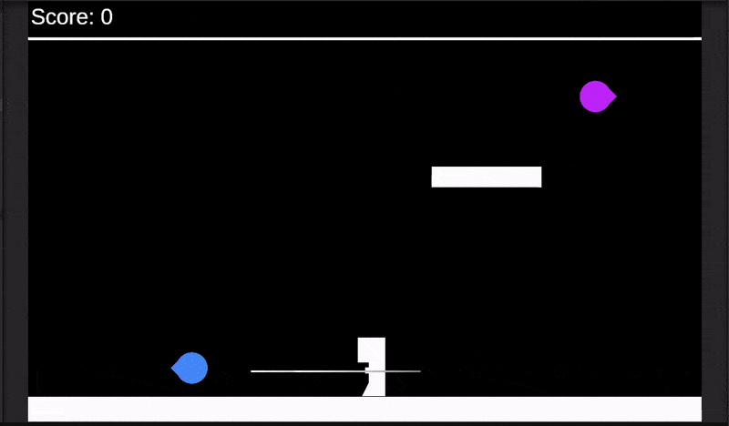
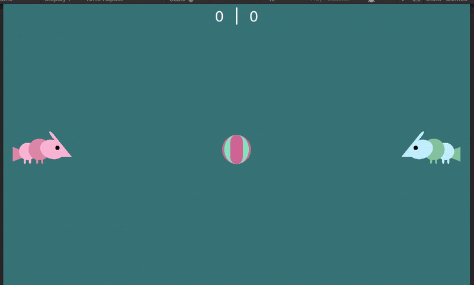
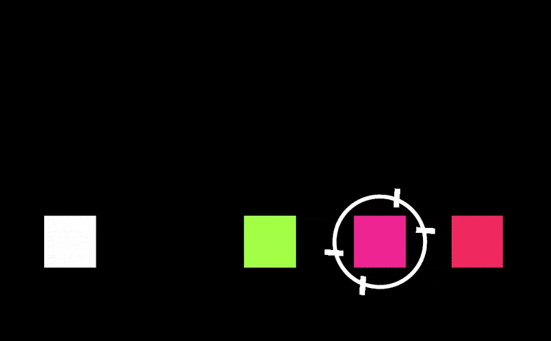
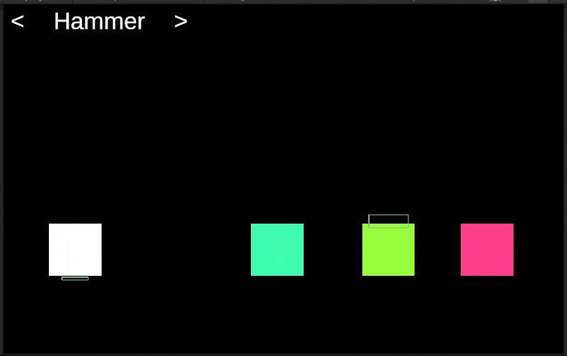
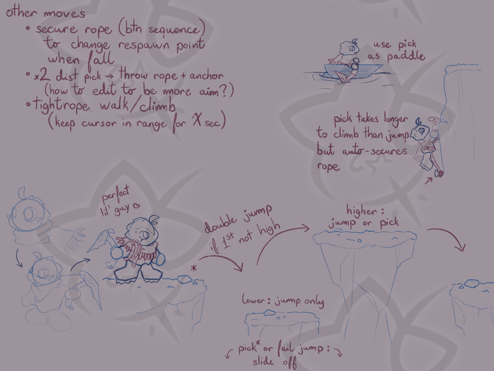

# Weekly Class Journal

## Week 1: Tiny Game (01-16-25 to 01-23-25)
### Tool Overview
- **Twine)** text-based, diverging choices; official documentation is structured w a sidebar, but kinda heavy (no examples)
- **Ink)** also text-based, diverging choices; official documentation is structured, has "code" examples (still a bit too clunky for me tho); apparently has a Unity plugin
- **Bitsy)** visual, tile-based (16x16), small sprites (8x8) and limited colors palettes (3 colors, but can change between rooms); various community tutorials; I prefer to work with visuals so going with this one for the tiny game

### Dev Notes
Saved my progress often with Bitsy, but had kind of a panic moment when I wanted to reload a previous data file via the "Load Data" button in the "Game" tab & the whole thing just reset **D:** The save files I had were fine and I just had to copy-paste them in the "Game/Data" subsection, just the "Load Data" option being buggy it seems (along with the game window after playtesting it). Refreshing the page every now & then fixes the visual bugs at least.

Also, there's no quick & easy way to reorder the rooms that I found (specifically to change which one the game starts in), gotta manually update it in the "Game/Data" subsection along with all sprite references to the rooms' indexes. Had fun figuring out how to get the change in perspective from top-down studio view to the side throwing view right tho.

Messed around with the generated HTML/css/Javascript to add a pretty start button bc why not **c:**

### Playtest Notes
- People liked how elaborate the experience was even if the game loop was extremely basic, the shift in perspective from studio to throwing, and that there were different ways to throw the clay on the wheel (lot of spritework went into this)
- Pretty much everyone always used the same wheel after (re)wedging the clay, but were pleasantly surprised when I pointed out that the game remembered which wheel was used and putting the avatar back next to the right seat
- Despite the door (intentionally) being the same color as the walls (as opposed to the interactable green sprites), someone still immediately went for it first thing into the game and got to the end screen lol

[Play the game here!](https://zettamarge.github.io/cart-315/Projects/1_TinyGame/POTTERY_GOBLIN.html)

## Week 2: Intro to Unity (01-23-25 to 01-29-25)
ahhhh the basics. rly takes me back to my cegep days. still getting enumerator/able mixed up oops

### TODO
Experiment w/ movement, colliders, physics materials, etc. Could just do a mini platformer thing

### Dev Notes
- Going w/ a Jetpac (1983) recreation instead. Having some issue making the raycast + lineRenderer work (nts: check values during play mode to see how to fix + keep script in PlayerControl)
- Got it to work w/ a certain number of lasers at all times (hooray!!). However, raycast collision detection is too precise & doesnt work well. Research indicates to use CircleCast as replacement. Also, it looks like theres a glitchy one near the starting position when I fire repeatedly, idk if it's functional or how to remove it, but no biggie.
- CircleCast addendum: the raycast would collide w/ the player, changed it to CircleCastAll and iterated to find a hit w/ an enemy.
- Player death & respawn is functional, added a score and an extra platform. Satisfactory for this experiment, all thats missing for a full Jetpac recreation is:
    - lives + game over
    - building + fueling the rocket, lvl transitions
    - bonus point items upon collection
    - sounds and actual sprites, better laser animation
    - awarding the rareware coin upon getting 5000 points **:p**

Project found under Projects/_experiments, asset folder P1 (nts: do folder hierarchy per experiment)

## Week 3: Pong (01-30-25 to 02-05-25)
Proto-Types:
- Look/Feel (no focus on function necessarily)
- Role (story, flowchart)
- Implementation (actual function, no focus on look necessarily)
- Integration (all of the above)

tennis. tennis. tennis. tennis. tennis.

### TODO
pong variation. or not idk.

### Dev Notes
- pawng -> prawn -> shrimp play with bouncy ball. mantis shrimp can punch ball real good (more velocity). segmented shrimp (gameObject w/ multiple circles, see trail renderer or Vector2.MoveTowards, individual colliders might work best) w/ tank controls? (LR: rotate, UD: move) for a more swim-feel
- bit annoying that dictionaries cant be edited from the inspector, but easy workaround using a serializable custom class
- smooth snake movement is hard, delay rotation? yes, also add more delay per subsequent body part for maximum effect. might keep completing the rotation even if doesnt move bc otherwise its veeeeeeery tricky to manage.
- except i actually got something that looks half decent???? just gotta keep the parts from going too far from each other now tho, but shrimp move good rn
- just had to lower the maxDistanceDelta, easy lol
- shrimp wrap doesnt work the same way as Jetpac's bc of the segments but isnt much trickier
- all that left is to increase bounciness & lower the velocity back down to a threshold over time, make gravity 0 to make it floaty w some random initial force
- could do like pawng template and have 2 shrimps trying to get the ball to the opposite side (color-code shrimps) (also keep screenwrap bc its funny)
- not sure how to slow down ball while keeping its bounciness w/ the moving players, the rotation is still a bit wonky at times but mostly all good; something to figure out at a later time i guess. other potential upgrades: actually doing the mantis punch (goes w/ better physics), baskets for the ball, eating plankton to grow bigger/longer (ie dynamically add and manage rotation of more segments)

Project found under Projects/_experiments, asset folder P2

## Week 4: Breakout (02-06-2025 to 02-12-2025)
singletons my beloved. and beloathed. unless u love load-bearing coconuts (we love load-bearing coconuts)

### TODO
prof suggestion: prefab variation (diff colours, values, etc)

breakout pinball? piano breakout? dk64randomizer dot com piano game? paper mario battle test?

### Dev Notes
- going with paper mario battle test; goal is hammer attack, should go as follows:
    - select enemy (input check), auto move player towards enemy (no input check)
    - when in position -> spawn hammer, start attack timer (input check)
    - if timer = 0 && no input, small bonk (1/2 damage)
    - if input -> rotate hammer back, change to input timer (with leeway for correct timing)
    - if early release -> small bonk (1/2 damage)
    - if late release -> miss (0 damage)
    - when input release/timer end -> rotate hammer, deal damage, despawn hammer, move back to start position (no input check)
    - if enemy has no hp -> kill
    - when in position, if no enemy -> spawn new enemy
    - restart
- enemies have random HPs and colour
- possible miss "animations": yeet or hammer fall back
- small bonk slower rotation?
- works just as planned, EZ (just gotta tweak the speeds a bit but shhh, and fix the rotation back on subsequent hits)
- for some reason sfx pitch remains at 1, even when changed in editor (NOTE its bc i added an AudioSource component directly to the gameobjects and not creating one from the dropdown menu, thats so dumb smh) (NOTE #2 ITS NOT EVEN THAT ITS JUST THAT ITS RESET TOO FAST, GOD)
- potential upgrades: abstract AttackManager down to fit w different types of attacks (inheritance) + attack selection menu, add enemy retaliation + type variation beyond just color and hp

Project found under Projects/_experiments, asset folder P3-4

### CREDITS
- Bonk sfx downloaded from [here](https://www.myinstants.com/en/instant/doge-bonk-84044/)
- other sfx generated with [Jsfx](https://sfxr.me/)

## Week 5: Winter Storm Alert (02-13-2025 to 02-19-2025)
no class oopsie

### TODO
prof suggestion: either build on the previous experiment or be something entirely new

### Dev Notes
- busy week assignment-wise, so in case i dont have time to implement it heres a theoretical jump attack to build off of the previous experiment:
    - add collision box over enemy (thicker) & under player (thinner)
    - select attack type
    - select enemy (input check), auto move player towards enemy (no input check) (same as hammer)
    - when in position -> auto aim to arc over & land on enemy
    - correct input timing is while OnCollisionStay2D w the 2 hitboxes, otherwise miss (1/2 damage)
    - if successful input -> arc back in front of enemy, then move back to start position (no input check)
    - otherwise -> complete arc down, then move back to start position (no input check)
    - if enemy has no hp -> kill (same as hammer)
    - when in position, if no enemy -> spawn new enemy (same as hammer)
    - restart (same as hammer)
- if not completed, insert prototype schematics here
- only thing missing code-wise rn would be the arc transition (the hecks a bezier curve), hopefully ill figure it out in time before class
- bezier quadratic curve is: p(t) = (1 − t)^2 * init + 2t(1 − t)anchor + t^2 * end
- looks clunky as hell but it works, hooray **c:** could probably just do one big bezier curve instead of the uppies and downies, might look better (NOTE: it does)
- added some delays here and there we love to see it, better feel

Project found under Projects/_experiments, asset folder P3-4

## Week 6-7: Going Into Reading Week (02-20-2025 to 03-05-2025)
oh thank god no end of semester presentation.

brainstorming: state the challenge/constraints -> criticism is ok + quantity over quality. once an idea is found, find smaller problem statements to better define it

### In-Class Brainstorming Session
Braindump: pottery idk
- making things on the wheel is called throwing
- wedge = getting the air out of the clay + making it firmer
- eat ur dirt (dont)
- fine clay particles are real bad for ur lungs
- throwing process: wet the bat, slam on the bat, stabilize, center (cone), open (make sure there is enough still for the foot), pinch the cylinder, optional but recommended to gather up excess clay from the base into the cylinder (tricky, watch out), actually make the shape from the cylinder, free up excess clay from the foot to help it dry, remove bat from wheel & let dry a bit before covering and letting the piece slowly dry
- bat (the animal)
- trimming process: center, keep in place w extra clay or batmate or whatever, finish the shape + the foot, decorate as desired, let dry
- kiln
- glaze

Hybrids:
- wheel bats -> thats just the batmobile
- dirt bats -> they sleep in caves idk
- "sandstorm" clay bats w a poison/petrification effect (bc it gets in ur lungs)

Speed Dating:
- glaze bandits : thieves running a bakery, trying to stay down-low from the law AND ur customers, heists to steal from other bakeries to make ur own better
- farming bats : either ur a fruit bat w a fruit farm, or ur farming herds of bats (via trees, u pick them like fruit)
- flying center: bird school for birds to teach them how to fly, floating islands, flying to the center of everything
- clay sorceress: tower defense game w little clay dudes/pots as ur units
- bats vs mice: bats have the top of the screen mice have the bottom, or a story about a vampire that turns into a mouse instead of a bat & gets flack for it
- sleep clay: a pottery student falls asleep while making a piece, nap in the kiln, stealth game in a mansion full of pottery (dont break them or itll wake grandma)
- light bat: escape from a mine while avoiding shining light on the bats or they get angry and attack
- thief colony: cult of the lamb style training little robbers, victorian-era aesthetic

as usual, ideas ended up being more thematic than system-based

### TODO
- extra credit journal entry: game mechanic analysis (due March 6)
- find an idea to prototype (not necessarily in unity yet, can be just on paper for now) that can be iterated upon in the coming weeks

### Dev Notes
probably the best thing to do here is build off the 2 previous experiment, gradually adding more systems to make it a proper demo. current possible iteration ideas include:
- scene transitions between overworld & battle, remembering position in overworld
- switching to Unity 3D for 2.5D perspective outside of combat
- refactor attack manager script to be more generalized and make it easier to implement other types of attacks
- enemy retaliation + modifiers (spikes mean cant jump on it, etc), defend action command
- finding new combat abilities in the overworld that are then added to ur possible actions in-battle
- if enough time, replace basic shapes with custom (still) sprites/icons

current possible conceptual ideas to make it more distinc than just a Paper Mario clone:
- game is based on exploration, turn-based battles are how u navigate treacherous environment (high wall to climb, big chasm to jump over, etc). when battle completed successfully, u spawn past it in the overworld (ex initiate battle from one end of a pit, spawn at the other side after the battle makes u cross it safely). enemy retaliations are environmental hazards (falling spikes, rocks getting dislodged & having to keep ur grip, earthquake, etc)

we love a funny little guy **:3** alas we got midterms to study for so this is most likely it for this week rip, still a decent plan imho